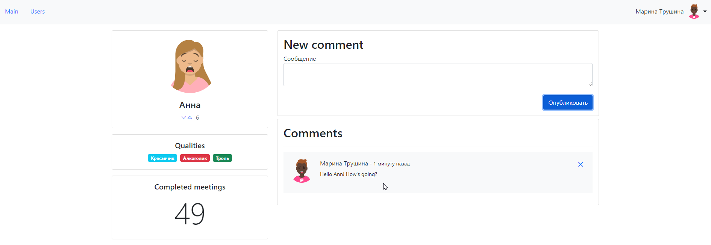
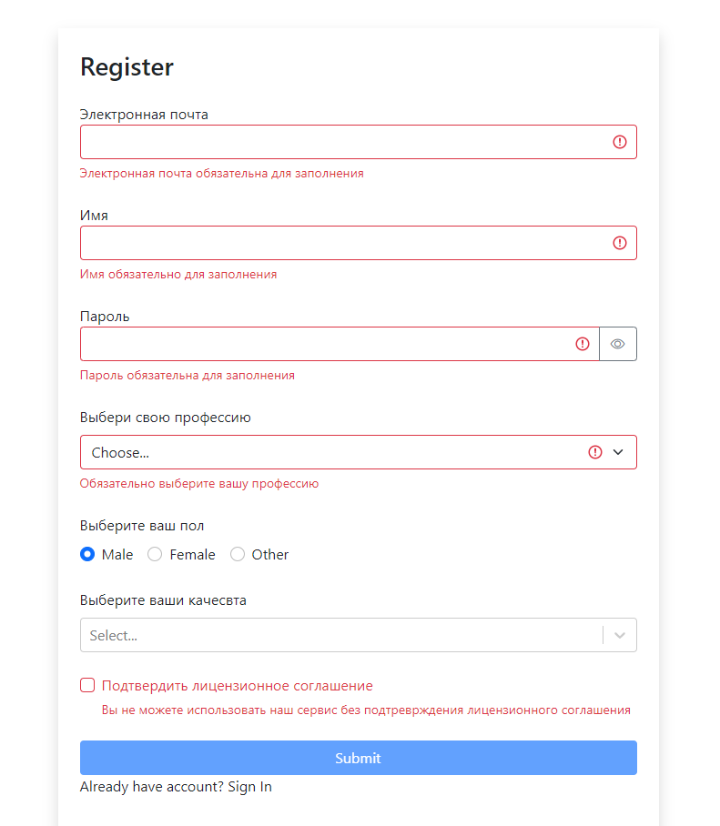
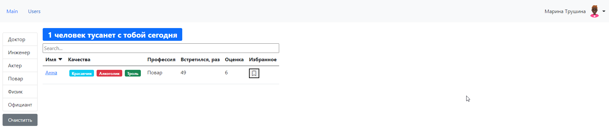
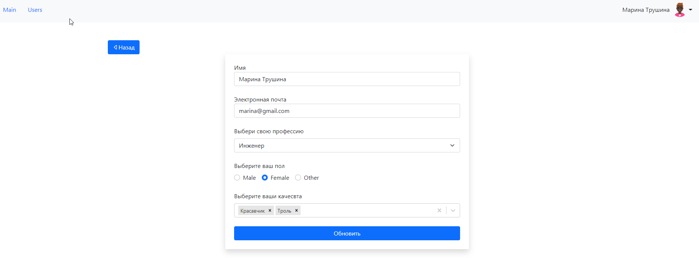

# FullStack course project FAST-COMPANY

<a href='https://fast-company-test-application.herokuapp.com/' >Live demo</a>

## Project description
1. Register in application

2. Now you can have an access to the list of other users.

3. You can choose one of them and click on his/her userPage, write message on his/her page.

4. You can go to your profile and change it, if it needs.

## Technologies used in project: React, Redux, Node, Express, MongoDB

## Future scope
Add vote for the rate to the person